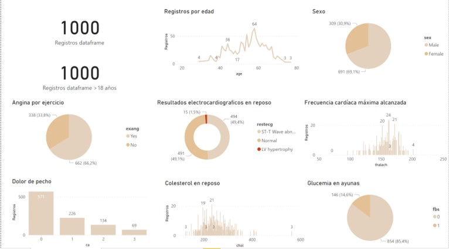
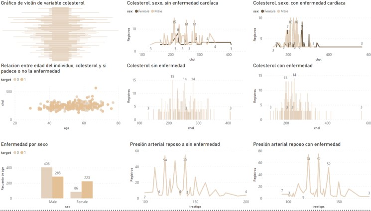
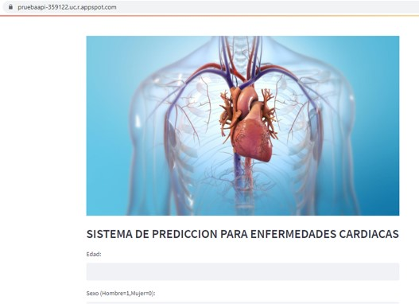
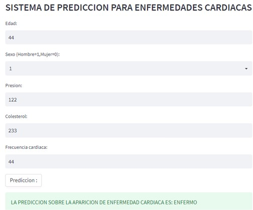
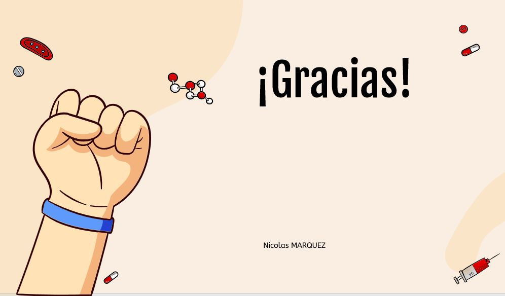

# Machine learning project with Python :snake:
## Heart disease prediction machine learning model. :man_health_worker: :heartbeat:

:exclamation: For more information or details of each project, please contact me! nico.marquez@hotmail.com :email:
 
 Below you will find some steps for you to better understand my project and explore it:

**1) First, I think that the best thing would be to visit the Executive Summary which explains the introduction of the project, objectives, problems, resolution and all the necessary information so that anyone, with or without knowledge of Data science, can read it.:**

https://github.com/NicoMarq/Machine-learning-project-with-Python/blob/main/Executive%20presentation%20of%20the%20project.pptx

**2) Now you are ready to take a look at the document with the code. Here the code is accompanied by a good Storytelling.** :speech_balloon:

Here you can find all the steps of a Machine learning project:\
Please, go to https://github.com/NicoMarq/Machine-learning-project-with-Python/blob/main/ProyectoFinal.ipynb:
\
\

******************************

******************************

******************************

******************************

**3) As a valuable addition, a Dashboard of performance metrics of the Machine Learning models was developed, as well as for other important project metrics:.**

Please, go to https://github.com/NicoMarq/Machine-learning-project-with-Python/blob/main/Heart_disease.pbix:

\
\

******************************

******************************

**4) Finally and I think the most important thing: Please, visit the following link where the Machine learning model was implemented in a web page:**

(https://pruebaapi-359122.uc.r.appspot.com/)

******************************

******************************

#***Thanks for visiting my portfolio!*** :wave:
