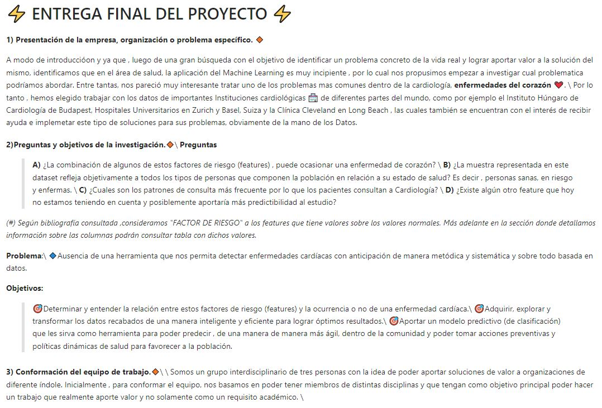
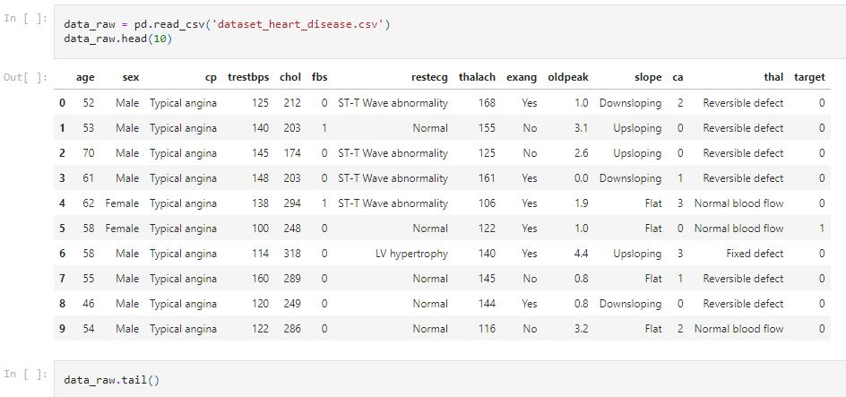
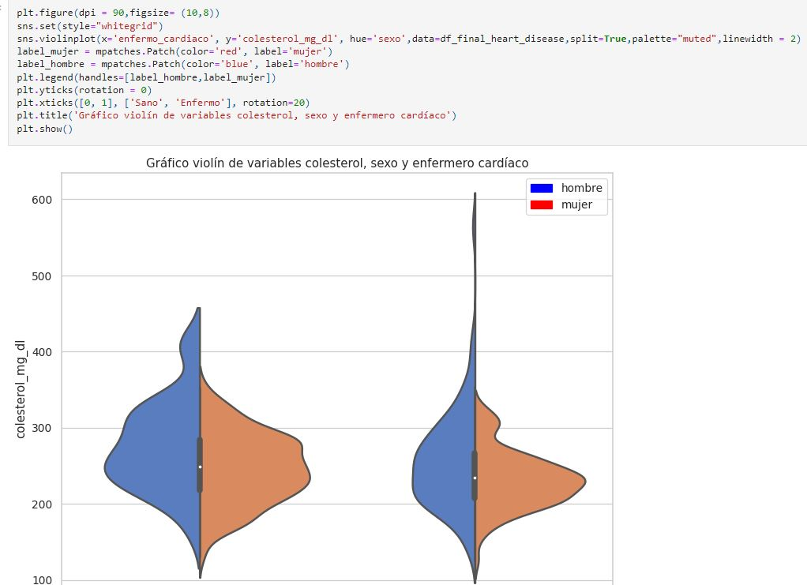
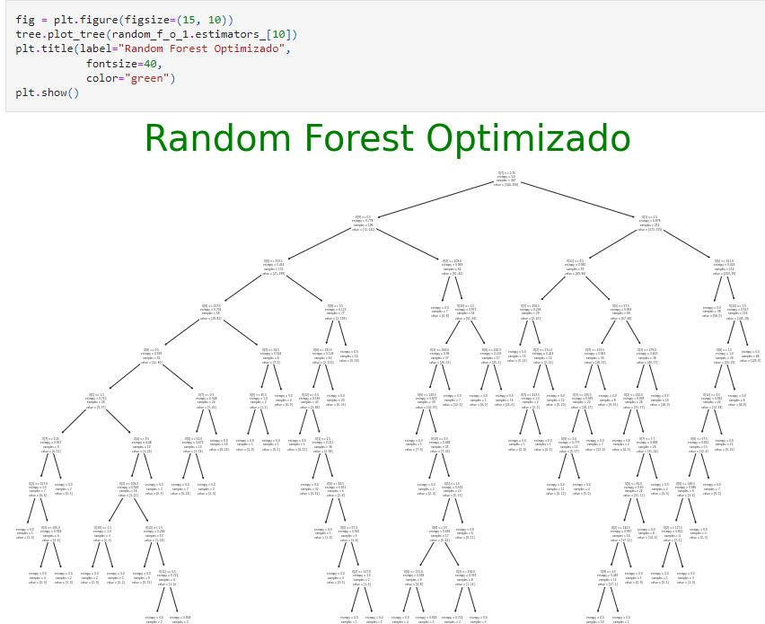

# Machine learning project with Python :snake:
## Heart disease prediction machine learning model. :man_health_worker: :heartbeat:

:exclamation: For more information or details of each project, please contact me! nico.marquez@hotmail.com :email:
 
 Below you will find some steps for you to better understand my project and explore it:

**1) First, I think that the best thing would be to visit the executive summary which explains the introduction of the project, objectives, problems, resolution and all the necessary information so that anyone, with or without knowledge of Data science, can read it.:**

https://github.com/NicoMarq/Machine-learning-project-with-Python/blob/main/Executive%20presentation%20of%20the%20project.pptx

**2) Now you are ready to take a look at the document with the code. Here the code is accompanied by a good Storytelling.** :speech_balloon:

Here you can find all the steps of a Machine learning project:\
Please, go to https://github.com/NicoMarq/Machine-learning-project-with-Python/blob/main/ProyectoFinal.ipynb:
\
\

******************************

******************************

******************************

******************************

**3) As a freelancer I was hired by a group of Mechanical Engineers to design and calculate a retractable tribune to apply it in real life. 
 The difference between the Gabriel and Emanuel rostrum was an automated scissor system.**

Retractable tribune:

**4) As a freelancer I am working with a plastic recycling machinery company. We are in the process of designing a machine to make plastic sleepers.**

Project:

**5) As a freelancer I worked with the Balancor company and developed an electronic scale for field grains.**

This was a machine with a hopper and built-in load cells to fill bags of corn kernels with an exact weight:

#***Thanks for visiting my portfolio!*** :wave:
